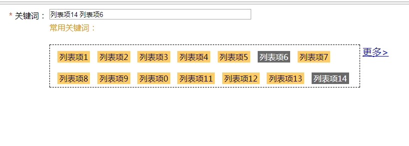
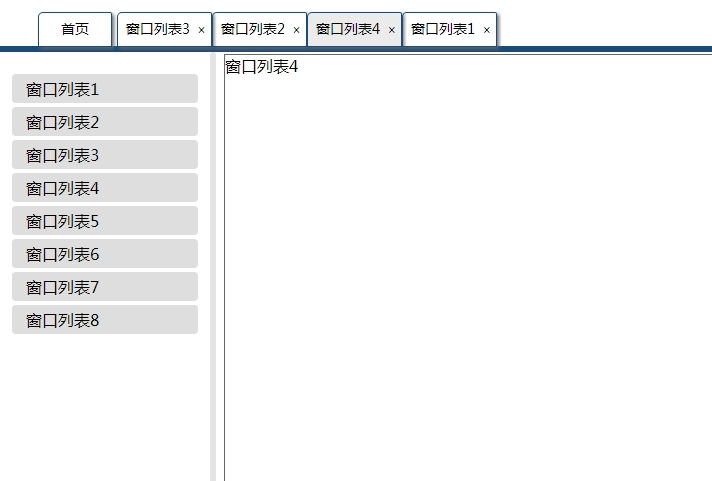
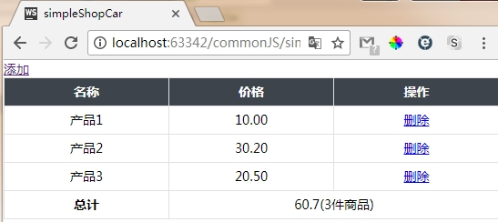
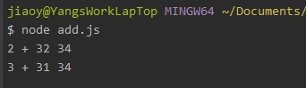
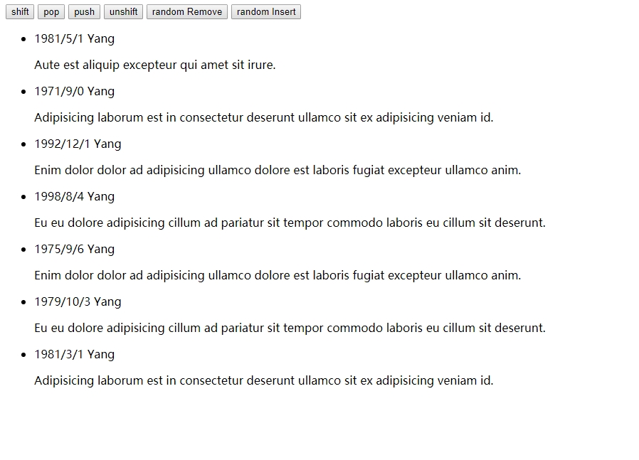
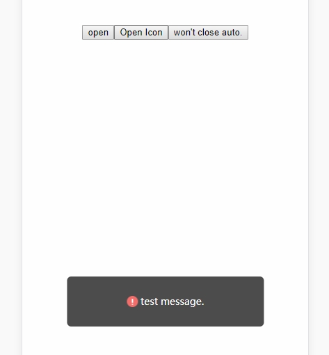

# Functions JS

Just like the repository named `commonStyle`, here's something useful or useless typed by myself.(although there is nothing...)

## 1.click-input

[Demo点这里](https://life1st.github.io/Functions/click-input/index.html)

预览图：

### 已实现功能

点击列表项，内容会添加到关键词的input框中；

在input中删除关键词，列表项会改变选中状态；

在input中手动输入列表项中有的关键词，列表项中的关键词会更新选中状态；

列表项超过10个时，初始状态只显示两行，同时添加`更多`按钮，点击后弹出所有项目；

读取输入框默认状态，并更新相关列表项状态；

>已修复输入框中输入列表中没有的项目时，再点击列表项会删除这些项目的问题。代码写得太烂了，功能都没做完，就想开始重构了。

## 2.tab-ui

[Demo点这里](https://life1st.github.io/Functions/tab-ui/index.html)

预览图：

### 已实现功能

左侧列表是已有的窗口，顶部导航栏默认首页（不可关闭），点击左侧标签后打开到窗口列表，同时在顶部导航栏添加一个tab。

已打开的tab可以点击切换，所有tab关闭后默认首页窗口。

## 3.simpleShopCar

[Demo点这里](https://life1st.github.io/Functions/simpleShopCar/index.html)

预览图：

昨天京东的一道笔试题。

说句题外话，京东的这个笔试题是我做过的所有大厂里最务实的，其他家的编程题全是什么算法，就很烦（当然主要原因是我菜）。京东这个就很好，很有兴趣。等什么时候算法学好了，估计算法题也有兴趣了。

### 已实现功能

向购物车添加时，更新产品列表和总计

点击删除时，删除产品和更新总计

#### TODO

总价的保留小数位数 //Done.

> update 2018.3.2

今儿去洋葱数学面试，前端大哥提到了这个 Demo ，所以更新了下。

但还是觉得有点问题。

比如 是不是在操作 Data 的时候应该 new 一下，然后把 数据 放到 类 里面。

还有在计算金额的时候，是不是每次都 for in 效率可以提高？//应该可以提高，我需要再加一个 totalPrice 的字段在 data 对象里。

## Voice Range

[Demo](https://life1st.github.io/Functions/voiceRange/dist/index.html)

## closureAdd

三月初去面试某厂时遇到的问题，现在想起来了整理一下。[code](./closureAdd/add.js)

## Vue transition list Animation

[Demo](https://life1st.github.io/Functions/vueListAnimate/index.html)

Vue 列表动画的实现 主要是通过 `v-move` 设置列表的平滑过渡。

## Vue Plugins

there are some vue plugins I write and use in my proj. If you interested about it, please click [readme](https://life1st.github.io/Functions/message/index.html) to know more. By the way, you can click [Demo](https://life1st.github.io/Functions/VuePlugin/dist/index.html) to see what is it look like.

 ## canvas huaji
 
 [Demo](https://life1st.github.io/Functions/huaji/dist/index.html)

## simple Chat(alpha)

 [Demo](https://life1st.github.io/Functions/simpleChat/client/index.html)

## inputPass

N 位数字的输入框 

 [Demo](https://life1st.github.io/Functions/inputPass/index.html)
